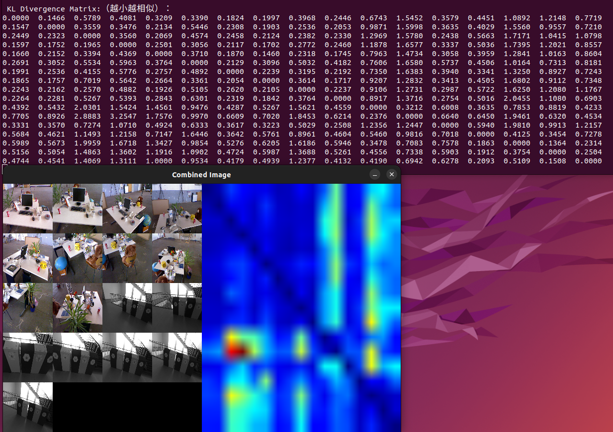
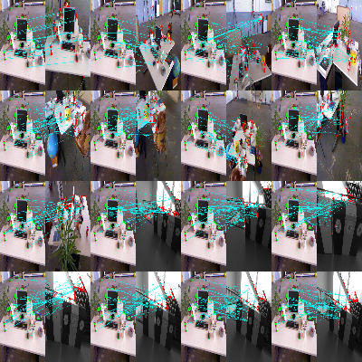
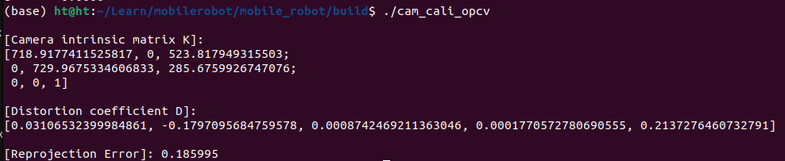
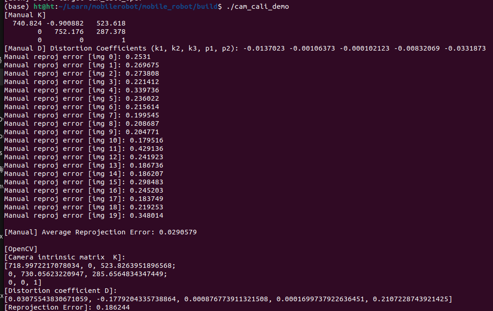
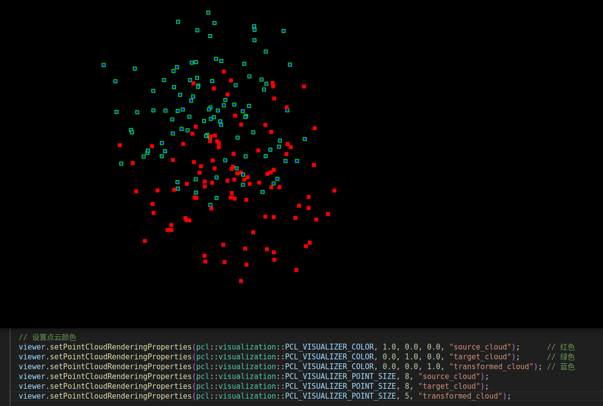
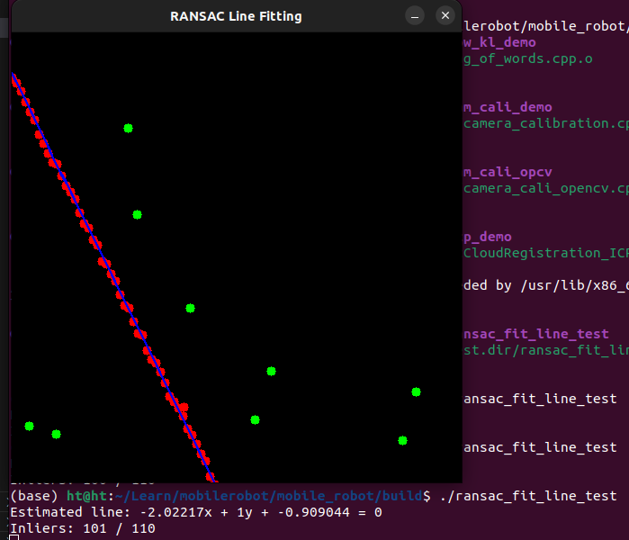

# Dependencies
- OpenCV 
- C++17 compiler
- CMake (>= 3.10)
- PCL (sudo apt-get install libpcl-dev)

# Build & Run
``` bash
cd mobile_robot
mkdir -p build && cd build
cmake ..
make
./xx_demo
```

# 1. Bag of words
- 特征提取--> ORB 提取关键点和描述符-->构建视觉词袋（BoW）模型--> 生成每张图片的 BoW直方图-->计算两两之间的相似度（KL散度）-->绘制KL散度矩阵的热力图（heatmap）
- (特征匹配可视化)
``` bash
./bow_kl_demo
```


# 2. camera calibration
- 遍历所有图片，检测棋盘格角点；
- 对每张图计算单应矩阵 H；
- 根据一组 H 估计内参矩阵 K；
- 对每张图解出外参（R, t）；
- 计算每张图的重投影误差（可以评估好坏）；
- 估计畸变系数 D
## only opencv:

## compare Manual and opencv:


# 3. PointCloudRegistration ICP
- 生成 source 点云 -->对 source 应用旋转+平移生成 target
- 执行 ICP, 每次迭代:匹配最近点-->计算中心-->SVD求旋转-->计算平移-->累计更新-->判断是否收敛
- 输出旋转矩阵和平移向量
- 可视化：source（红） vs target（绿） vs transformed_source（蓝）



# 4. ransac
- 生成点集 → RANSAC拟合 → 分类内外点 → 用OpenCV绘图展示结果
- RANSAC 直线拟合类
- - class LineModel：简单存储一条直线的参数 a, b, c 和它的内点索引。
- - class RansacFitLine：
- - 成员变量：设置了内点距离阈值 (threshold_)、最大迭代次数 (max_iterations_)、最佳分数 (best_score_)、以及内部存储的点。
- - Estimate()：主函数，进行 RANSAC 拟合。
- - - 随机采样两点组成直线；
- - - 评估这条直线包含多少内点（Evaluate）；
- - - 保存最优模型（即最多内点的那条线）。
- - GetLineSlope()：根据两点计算直线方程 ax+by+c=0。
- - Evaluate()：根据点到直线的距离，判断是否是内点，计算得分。
